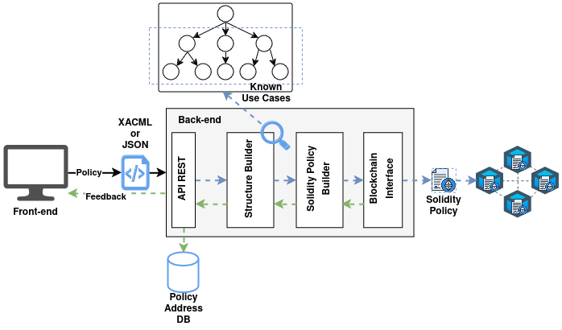

# ExtremeXP Policy Translator


This project translates XACML policies to Solidity smart contracts.
The project is based on the [XACML](https://www.oasis-open.org/committees/xacml/) standard 
and the [Solidity](https://soliditylang.org/) programming language.

## Project Architecture
The code is only for the translator backend. The frontend can be anything that sends a POST request with the XACML policy to the backend as a JSON.


## Development Progress
#### Overall progress: 


#### Tasks:
- [x] Project Basic Structure (Flask API + Endpoints + kickoff script)
- [ ] XACML/JSON to the PolicyGraph structure (Structure Builder module)
- [ ] Map the XACML basic functions over the PolicyGraph (See: https://en.wikipedia.org/wiki/XACML#Functions)
- [ ] Translate the PolicyGraph to a Solidity Smart Contract (Solidity Policy Builder module)
- [ ] Deploy the Smart Contract and retrieve the address (Blockchain Interface module)
- [ ] Register the Policy address to the database (Policy Address DB)
- [ ] Integrate with the Keycloak Authorization Server (OAuth or MetaMask)

## Getting Started
```bash
# install the project development environment
make install
# run the project
make run
```
The server will be running on http://localhost:5521.
The Swagger documentation is available in the root page.
